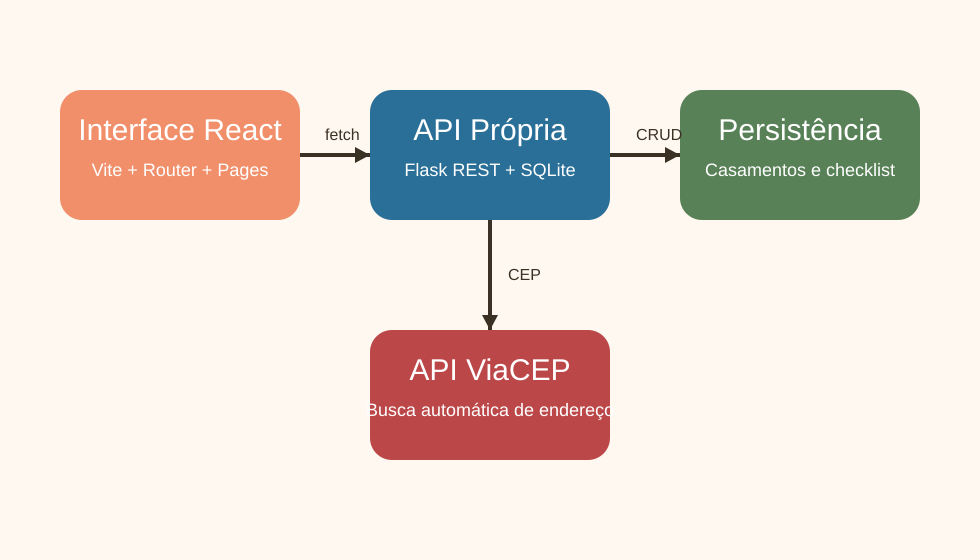

# Frontend React - Checklist Casamento

Interface React do MVP da PUC-Rio para gestão de casamentos. Este módulo consome a API Flask própria, substitui a antiga persistência em `localStorage` por chamadas HTTP e integra a API ViaCEP no formulário de endereço do casal.

## Tecnologias

- React 19
- Vite
- React Router
- Fetch API
- Docker

## Como executar com Docker

```bash
cd Frontend_checkListCasamentos
docker build -t checklist-casamento-frontend .
docker run --rm -p 5173:80 checklist-casamento-frontend
```

A interface ficará disponível em [http://localhost:5173](http://localhost:5173).

Em desenvolvimento (`npm run dev`), as chamadas vão para o mesmo host do Vite e são encaminhadas a `http://127.0.0.1:5001` (use `VITE_PROXY_TARGET` se a API estiver em outra URL). Evite definir `VITE_API_BASE_URL` só para dev — isso faria o browser chamar a API direto e exigiria CORS. No build de produção, use `VITE_API_BASE_URL` ou o fallback `http://localhost:5001`.

## Fluxograma da arquitetura



A API própria e o Swagger usam a porta **5001** por padrão: **http://localhost:5001/swagger**. O ViaCEP é chamado **direto do navegador** (não passa pelo Flask).

## Funcionalidades implementadas

- Listagem de casamentos carregada pela API Flask
- Edição dos dados do casal com `PUT /casamentos/:id`
- Checklist da cerimônia com atualização remota por item
- Contador de convidados persistido no backend
- Busca de endereço por CEP com consumo real da API ViaCEP

## Estrutura

- `src/hooks/useWeddingData.js`: hook central para consumo da API
- `src/services/api.js`: cliente HTTP da aplicação
- `src/pages/Casal`: formulário com integração ViaCEP
- `src/pages/Cerimonia`: checklist persistido na API

## Observação

Na entrega final da disciplina, o frontend deve ser publicado em um repositório público separado do backend.
